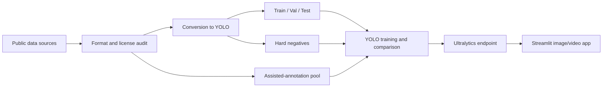

# Ultralytics Wildfire Pipeline

An end-to-end computer-vision pipeline for preparing wildfire data, training and deploying YOLO models, and analyzing images or videos for **smoke** and **fire**.

[](https://www.python.org/)
[](https://www.ultralytics.com/)
[](https://streamlit.io/)
[](LICENSE)

> This repository contains source code and documentation only. Datasets, trained weights, raw videos, credentials, and administrative files are intentionally excluded.

## Public demonstrations

### Full video

[](https://www.youtube.com/watch?v=3ki38BnKBHg&feature=youtu.be)

[Watch “YOLO26 Benchmark: Wildfire Early Warning System with Ultralytics Platform (End-to-End)” on YouTube](https://www.youtube.com/watch?v=3ki38BnKBHg&feature=youtu.be)

### YouTube Short

[](https://www.youtube.com/shorts/wGNq1XQbScE)

[Watch “AI Wildfire Early Warning System with Ultralytics Platform” on YouTube](https://www.youtube.com/shorts/wGNq1XQbScE)

## Why this project matters

Early detection can shorten the time between the first visible smoke plume and human review. This project explores how heterogeneous inputs—including still images, PASCAL VOC annotations, YOLO labels, segmentation masks, and aerial video—can be transformed into a consistent two-class detection workflow:

```yaml
0: smoke
1: fire
```

The project is not only about fitting an object detector. It makes the data-engineering work visible: source provenance, label normalization, format conversion, difficult negative examples, assisted annotation, model deployment, and a reviewable inference interface. These concerns are particularly relevant to regions exposed to recurring wildfire seasons, including Chile, the rest of Latin America, Australia, and the Mediterranean.

This is a research and educational prototype. It is not a certified emergency-alert or life-safety system and does not replace specialized sensors, emergency services, or review by qualified personnel.

## Project workflow



The local working snapshot produced 218 images with bounding-box annotations, split into 171 training, 23 validation, and 24 test images. It also incorporated difficult negatives and a 2,433-image assisted-annotation pool. These generated artifacts are not redistributed here because of size, provenance, and licensing constraints.

## Research foundation

The following papers were reviewed while defining the data strategy, smoke/fire class mapping, aerial-imagery workflow, model baselines, and deployment narrative. Listing a paper here does not mean that every method or reported result was reproduced in this repository.

### Papers reviewed

| Year | Reference | Relevance to this project | Primary source |
|---|---|---|---|
| 2026 | J. Wang and C. Yan, “CEVG-RTNet: A real-time architecture for robust forest fire smoke detection in complex environments,” *Neural Networks*, vol. 194, 108187. | Real-time smoke detection, transparent/low-contrast smoke, lightweight deployment, and a YOLO11-based experimental pipeline. | [Paper DOI](https://doi.org/10.1016/j.neunet.2025.108187) · [Official code](https://github.com/CNNanmuzi/CEVG-RTNet) |
| 2025 | G. Çınarer, “Hybrid Backbone-Based Deep Learning Model for Early Detection of Forest Fire Smoke,” *Applied Sciences*, vol. 15, no. 13, 7178. | Early smoke detection and comparison of multiple YOLO/backbone configurations. | [Paper DOI](https://doi.org/10.3390/app15137178) |
| 2025 | M. Wang, P. Yue, L. Jiang, D. Yu, T. Tuo, and J. Li, “An open flame and smoke detection dataset for deep learning in remote sensing based fire detection,” *Geo-spatial Information Science*, vol. 28, no. 2, pp. 511–526. | FASDD and its ground, UAV, and remote-sensing domains; fire/smoke object-detection labels. | [Paper DOI](https://doi.org/10.1080/10095020.2024.2347922) · [FASDD data](https://doi.org/10.57760/sciencedb.j00104.00103) · [Project repository](https://github.com/OyamingO/FASDD) |
| 2025 | L. Liu, L. Chen, and M. Asadi, “Capsule neural network and adapted golden search optimizer based forest fire and smoke detection,” *Scientific Reports*, vol. 15, 4187. | Evaluation on wildfire imagery and BoWFire, including challenging fire-like negatives. | [Paper DOI](https://doi.org/10.1038/s41598-024-81742-y) |
| 2025 | P. Keerthinathan et al., “Advancing Real-Time Aerial Wildfire Detection Through Plume Recognition and Knowledge Distillation,” *Drones*, vol. 9, no. 12, 827. | UAV plume recognition, assisted annotation, knowledge distillation, and edge-oriented detection. | [Paper DOI](https://doi.org/10.3390/drones9120827) · [Canungra UAS data](https://doi.org/10.25912/RDF_1764134706710) |
| 2022 | X. Chen et al., “Wildland Fire Detection and Monitoring Using a Drone-Collected RGB/IR Image Dataset,” *IEEE Access*, vol. 10, pp. 121301–121317. | FLAME 2, paired RGB/thermal UAV imagery, prescribed-fire monitoring, and multimodal labeling. | [Paper DOI](https://doi.org/10.1109/ACCESS.2022.3222805) · [FLAME 2 data DOI](https://doi.org/10.21227/swyw-6j78) · [Official code](https://github.com/XiwenChen-Clemson/Flame_2_dataset) |
| 2022 | R. Eldan and I. Daniel, “Wildfire Smoke Detection by Computer Vision.” | Chilean early-warning context and a YOLOv7 smoke-column detection experiment. The reviewed document does not list a DOI or journal venue. | [Public manuscript record](https://www.researchgate.net/publication/367088845_Wildfire_Smoke_Detection_with_Computer_Vision) |

### Data sources processed in the local workflow

These sources were downloaded or inspected during the local preparation experiments. Only code, references, and derived counts are published in this repository.

| Data source | How it was investigated | Official or publisher source |
|---|---|---|
| DataCluster Labs Fire and Smoke Dataset | PASCAL VOC structure inspection and conversion to YOLO bounding boxes. | [Kaggle dataset page](https://www.kaggle.com/datasets/dataclusterlabs/fire-and-smoke-dataset) |
| BoWFire Dataset | Binary-mask inspection, fire bounding-box extraction, and difficult non-fire examples. | [GBDI project page](https://gbdi.icmc.usp.br/projects.html) · [Bitbucket downloads](https://bitbucket.org/gbdi/bowfire-dataset/downloads/) |
| FLAME 2 | RGB-video inspection and sampled frame extraction for fire/smoke and negative pools. | [IEEE DataPort DOI](https://doi.org/10.21227/swyw-6j78) · [Official code](https://github.com/XiwenChen-Clemson/Flame_2_dataset) |
| Dataset for Forest Fire Detection | Fire/no-fire classification images evaluated as candidates for assisted annotation. | [Mendeley Data DOI](https://doi.org/10.17632/gjmr63rz2r.1) |
| Fire Detection from CCTV | Directory and annotation audit; inspected as a candidate source but not retained in the final labeled snapshot. | [Kaggle dataset page](https://www.kaggle.com/datasets/ritupande/fire-detection-from-cctv) |

### Additional datasets and repositories researched

These sources were evaluated during the dataset-ranking and provenance-review stage. “Researched” does not imply inclusion in the final dataset, redistribution, or approval for commercial use.

| Data source | Research interest | Source |
|---|---|---|
| FASDD: Flame and Smoke Detection Dataset | Large cross-domain benchmark with ground, UAV, and remote-sensing subsets. | [Data DOI](https://doi.org/10.57760/sciencedb.j00104.00103) · [Repository](https://github.com/OyamingO/FASDD) |
| AI for Mankind Wildfire Smoke Dataset | Bounding-box annotations for early smoke plumes and fixed-camera scenes. | [GitHub](https://github.com/aiformankind/wildfire-smoke-dataset) · [Archived release](https://doi.org/10.5281/zenodo.6893839) |
| Canungra control-fire UAS dataset | Aerial plume imagery collected during controlled burns in Queensland, Australia. | [QUT data DOI](https://doi.org/10.25912/RDF_1764134706710) |
| HPWREN Fire Ignition Images Library (FIgLib) | Long-range fixed-camera wildfire ignition and early-smoke imagery. | [HPWREN/UC San Diego](https://www.hpwren.ucsd.edu/FIgLib/) |
| Fire and smoke detection YOLOv4 dataset | Existing YOLO-style fire/smoke labels and class-remapping study. | [GitHub](https://github.com/gengyanlei/fire-smoke-detect-yolov4) |
| D-Fire | Fire/smoke object-detection benchmark and YOLO-format annotations. | [GitHub](https://github.com/gaiasd/DFireDataset) · [Related paper DOI](https://doi.org/10.1109/LA-CCI48322.2021.9769824) |
| The Wildfire Dataset | Wildfire/smoke imagery referenced by the 2025 capsule-network paper. | [Kaggle](https://www.kaggle.com/datasets/elmadafri/the-wildfire-dataset) |
| Extended Wildfire Smoke Dataset | Extended smoke and smoke-like image collection evaluated for provenance and licensing. | [Zenodo record](https://doi.org/10.5281/zenodo.14218779) |
| MIVIA fire/smoke video datasets | Video-based smoke/fire detection benchmark considered during source review. | [MIVIA dataset portal](https://mivia.unisa.it/datasets/video-analysis-datasets/fire-detection-dataset/) |
| FireNET | Lightweight fire/smoke detection model and annotated image source. | [GitHub](https://github.com/OlafenwaMoses/FireNET) |
| CAIR Fire Detection Image Dataset | Fire/no-fire classification images considered during the broader survey. | [GitHub](https://github.com/cair/Fire-Detection-Image-Dataset) |
| Fire Detection repository | Additional classification source evaluated during initial discovery. | [GitHub](https://github.com/jackfrost1411/fire-detection) |
| Next Day Wildfire Spread | Satellite-based wildfire-spread prediction dataset; reviewed as adjacent research rather than an object-detection input. | [Kaggle](https://www.kaggle.com/datasets/fantineh/next-day-wildfire-spread) |

### Data licensing and provenance

Dataset access, open access, and permission to redistribute are different concepts. Before downloading, training on, publishing, or commercially using any source above:

1. read the current license and terms on the original source page;
2. preserve the authors, DOI, version, and download URL in a data manifest;
3. verify whether derivative annotations and model weights may be redistributed;
4. do not assume that a public download or an academic-use dataset permits commercial use;
5. document every class transformation—this project consistently uses `smoke=0` and `fire=1`;
6. keep rejected or unclear-provenance sources out of published training artifacts.

## Repository contents

```text
.
├── app.py                              # Streamlit interface for remote inference
├── configs/data.yaml                   # class and split definition
├── notebooks/
│   └── wildfire_dataset_pipeline.ipynb # audit, conversion, and packaging workflow
├── scripts/
│   ├── create_folder_structure.py      # creates the Ultralytics directory layout
│   └── label_converter.py              # VOC/YOLO/BoWFire conversion and validation
├── .env.example                        # variable names only; no secrets
├── .gitignore
├── LICENSE                             # MIT license for original code
├── NOTICE                              # safety, third-party, and attribution notices
└── requirements.txt
```

## Quick start on Windows PowerShell

```powershell
git clone https://github.com/DavidHospinal/ultralytics-wildfire-pipeline.git
cd ultralytics-wildfire-pipeline

py -m venv .venv
.\.venv\Scripts\Activate.ps1
python -m pip install --upgrade pip
pip install -r requirements.txt
```

Configure the private credentials for your deployed Ultralytics Platform endpoint in the current shell session:

```powershell
$env:ULTRALYTICS_ENDPOINT_URL = "https://your-endpoint/predict"
$env:ULTRALYTICS_API_KEY = "your-api-key"
streamlit run app.py
```

The application accepts JPG, PNG, BMP, MP4, AVI, and MOV files. For video, it processes every _N-th_ frame, reports detection statistics, and provides the annotated result for download.

## Data preparation

Define your local paths before opening the notebook:

```powershell
$env:WILDFIRE_DATA_ROOT = "D:\path\to\source-datasets"
$env:WILDFIRE_OUTPUT_ROOT = "D:\path\to\Wildfire_Mega_Dataset"
jupyter notebook notebooks\wildfire_dataset_pipeline.ipynb
```

To create only the expected directory structure:

```powershell
$env:WILDFIRE_BASE_DIR = "$PWD\data"
python scripts\create_folder_structure.py
```

Label-converter examples:

```powershell
# Validate YOLO labels
python scripts\label_converter.py --action verify --src data\labels

# Convert PASCAL VOC annotations to YOLO
python scripts\label_converter.py --action convert_voc --src data\voc --dst data\labels

# Remap numeric class IDs
python scripts\label_converter.py --action remap_yolo --src data\source-labels --dst data\labels --dataset gengyanlei
```

## Security

- Never place an API key directly in `app.py`, a notebook, or a commit.
- Use environment variables or the deployment platform’s secret manager.
- If a key reaches a local file or Git history, revoke and rotate it. Removing it from the latest commit does not invalidate the credential or guarantee its removal from history.
- `.gitignore` excludes common secret files, datasets, weights, experiment outputs, archives, and administrative material.

## Limitations and next steps

- Trained weights and final cross-model benchmark metrics are not included.
- Each user must provide an inference endpoint and API key.
- Performance must be validated for the target geography, camera, sensor, weather, lighting, smoke conditions, and observation distance.
- Operational use requires false-positive/false-negative analysis, monitoring, redundancy, incident-response procedures, and human review.
- The local snapshot is a development artifact and should not be treated as a representative global wildfire benchmark.

## Author and context

Developed by [David Hospinal](https://www.youtube.com/@oscardavidhospinal) / H'spinal Systems as an end-to-end technical demonstration with Ultralytics Platform. The project was publicly presented in the videos linked above.

## License

The original code and documentation in this repository are released under the [MIT License](LICENSE), Copyright © 2026 Ultralytics Wildfire Pipeline — H'spinal Systems.

Operational-use, third-party, and attribution notices are provided in [NOTICE](NOTICE). The repository license does not automatically apply to datasets, pretrained models, videos, services, or third-party dependencies; each resource remains subject to the terms set by its original provider.
