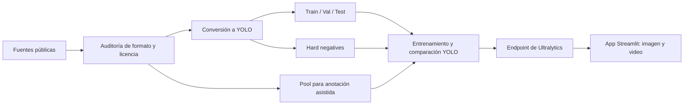

# Ultralytics Wildfire Pipeline

Pipeline reproducible de visión por computador para preparar datos, entrenar/desplegar modelos YOLO y analizar imágenes o videos en busca de **humo** e **incendios forestales**.

[](https://www.python.org/)
[](https://www.ultralytics.com/)
[](https://streamlit.io/)
[](LICENSE)

> Este repositorio contiene código y documentación. Los datasets, pesos, videos brutos, credenciales y archivos administrativos se excluyen deliberadamente.

## Demostración pública

### Video completo

[](https://www.youtube.com/watch?v=3ki38BnKBHg&feature=youtu.be)

[Ver “YOLO26 Benchmark: Wildfire Early Warning System with Ultralytics Platform (End-to-End)” en YouTube](https://www.youtube.com/watch?v=3ki38BnKBHg&feature=youtu.be)

### YouTube Short

[](https://www.youtube.com/shorts/wGNq1XQbScE)

[Ver “AI Wildfire Early Warning System with Ultralytics Platform” en YouTube](https://www.youtube.com/shorts/wGNq1XQbScE)

## ¿Por qué es importante?

La detección temprana puede reducir el tiempo entre la aparición de una columna de humo y la revisión humana. Este proyecto explora cómo convertir fuentes heterogéneas —imágenes, anotaciones VOC, etiquetas YOLO, máscaras y video aéreo— en un flujo coherente para dos clases:

```yaml
0: smoke
1: fire
```

El valor del proyecto no está solamente en entrenar un detector. También está en hacer visible el trabajo previo que determina su calidad: procedencia de datos, normalización de clases, conversión de etiquetas, incorporación de casos negativos difíciles y despliegue de una interfaz verificable. Esto es especialmente relevante en territorios expuestos a temporadas de incendios como Chile, otros países de Latinoamérica, Australia y la región mediterránea.

Este es un prototipo de investigación y divulgación. No sustituye sistemas certificados de emergencia, sensores especializados ni la validación de un operador humano.

## Flujo del proyecto



El snapshot local de trabajo produjo 218 imágenes con bounding boxes divididas en 171/23/24 para entrenamiento, validación y prueba; además incorporó negativos difíciles y un pool de 2.433 imágenes para anotación asistida. Esos artefactos no se redistribuyen en este repositorio por tamaño, trazabilidad y licencias.

## Contenido del repositorio

```text
.
├── app.py                              # interfaz Streamlit para inferencia remota
├── configs/data.yaml                   # esquema de clases y splits
├── notebooks/
│   └── wildfire_dataset_pipeline.ipynb # auditoría, conversión y empaquetado
├── scripts/
│   ├── create_folder_structure.py      # crea la estructura Ultralytics
│   └── label_converter.py              # VOC/YOLO/BoWFire y validación
├── .env.example                        # nombres de variables, sin secretos
├── .gitignore
├── LICENSE                             # licencia MIT del código original
├── NOTICE                              # avisos de uso y atribución
└── requirements.txt
```

## Inicio rápido en Windows PowerShell

```powershell
git clone https://github.com/DavidHospinal/ultralytics-wildfire-pipeline.git
cd ultralytics-wildfire-pipeline

py -m venv .venv
.\.venv\Scripts\Activate.ps1
python -m pip install --upgrade pip
pip install -r requirements.txt
```

Configura en la sesión tus credenciales privadas del endpoint desplegado en Ultralytics Platform:

```powershell
$env:ULTRALYTICS_ENDPOINT_URL = "https://tu-endpoint/predict"
$env:ULTRALYTICS_API_KEY = "tu-api-key"
streamlit run app.py
```

La app acepta JPG, PNG, BMP, MP4, AVI y MOV. En video procesa un frame cada _N_ cuadros, muestra métricas y permite descargar el resultado anotado.

## Preparación de datos

Define las rutas antes de abrir el notebook:

```powershell
$env:WILDFIRE_DATA_ROOT = "D:\ruta\a\datasets-originales"
$env:WILDFIRE_OUTPUT_ROOT = "D:\ruta\a\Wildfire_Mega_Dataset"
jupyter notebook notebooks\wildfire_dataset_pipeline.ipynb
```

También puedes crear solamente la estructura base:

```powershell
$env:WILDFIRE_BASE_DIR = "$PWD\data"
python scripts\create_folder_structure.py
```

Ejemplos del conversor:

```powershell
# Validar etiquetas YOLO
python scripts\label_converter.py --action verify --src data\labels

# Convertir PASCAL VOC a YOLO
python scripts\label_converter.py --action convert_voc --src data\voc --dst data\labels

# Remapear IDs de clases
python scripts\label_converter.py --action remap_yolo --src data\source-labels --dst data\labels --dataset gengyanlei
```

## Datos y trazabilidad

El pipeline evaluó distintas fuentes públicas y formatos, entre ellos FLAME 2, BoWFire y conjuntos con anotaciones VOC/YOLO. Antes de descargar, entrenar o redistribuir cualquier dataset:

1. revisa la licencia en la fuente original;
2. conserva la atribución y la URL de procedencia;
3. no asumas que “acceso abierto” equivale a permiso de redistribución o uso comercial;
4. evita publicar copias de imágenes o ZIPs si la licencia no lo permite;
5. documenta el mapeo exacto de clases. En este proyecto el orden es siempre `smoke=0`, `fire=1`.

## Seguridad

- Nunca escribas una API key directamente en `app.py`, un notebook o un commit.
- Usa variables de entorno o el gestor de secretos del entorno de despliegue.
- Si una clave llegó a un archivo local o a Git, revócala y genera una nueva; borrarla del último commit no invalida la credencial ni garantiza que desaparezca del historial.
- `.gitignore` bloquea secretos habituales, datasets, pesos, resultados, archivos comprimidos y material administrativo.

## Limitaciones y próximos pasos

- No se incluyen pesos entrenados ni métricas finales comparables entre modelos.
- El endpoint y la API key son aportados por cada usuario.
- El desempeño debe validarse por región, tipo de cámara, clima, iluminación y distancia.
- Antes de uso operacional hacen falta evaluación de falsos positivos/negativos, monitoreo, redundancia y un protocolo de revisión humana.

## Autor y contexto

Desarrollado por [David Hospinal](https://www.youtube.com/@oscardavidhospinal) / Hospinal Systems como demostración técnica de un flujo _end-to-end_ con Ultralytics Platform. El proyecto fue presentado públicamente en los videos enlazados arriba.

## Licencia

El código y la documentación original de este repositorio se distribuyen bajo la [licencia MIT](LICENSE), Copyright © 2026 Ultralytics Wildfire Pipeline — H'spinal Systems.

Los avisos sobre el uso del prototipo, seguridad operacional y atribución están en [NOTICE](NOTICE). La licencia del repositorio no se extiende automáticamente a datasets, modelos preentrenados, videos, servicios ni dependencias de terceros. Cada recurso conserva los términos establecidos por su fuente original.
